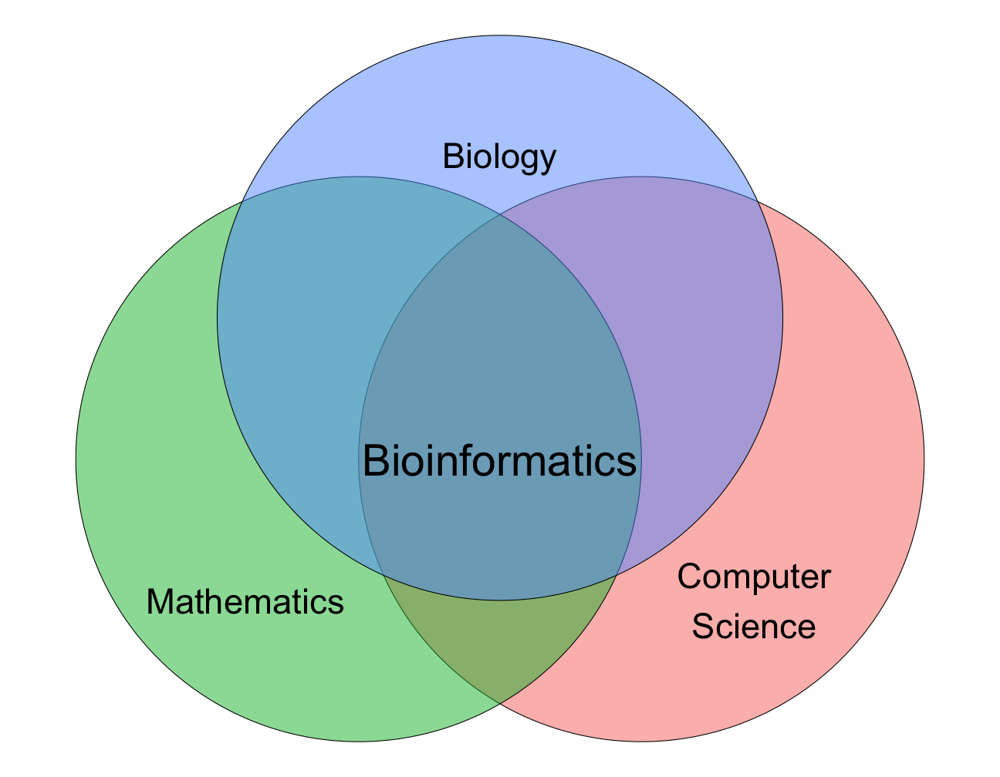
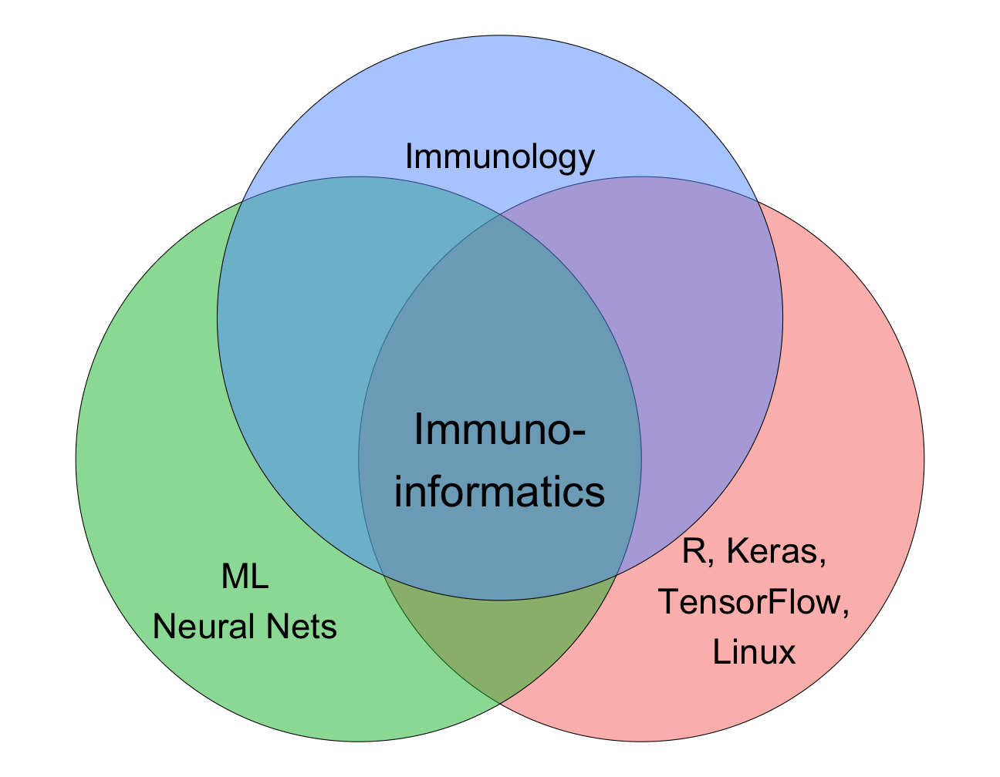

```{r setup, include=FALSE}
knitr::opts_chunk$set(echo = FALSE)
library('tidyverse')
```

## Why this workshop?

- The aim of this workshop is to _introduce_ you to artificial neural networks in R

- The key here being _introduce_, we have limited time, so you will mainly be working with code I created

- My intention is then to leave the GitHub repo as is, so you can return and revisit and expand/modify my code: [https://github.com/leonjessen/RPharma2019](https://github.com/leonjessen/RPharma2019)

- The learning objectives are (What you can expect to able to upon workshop conclusion):
  - Conceptually describe
    - What an ANN is
    - How an ANN is trained and how predictions are made
    - hyperparameters like architecture, learning rate, batch size, epochs, activation-, loss and optimizer functions
    - Training versus test partition in context of overfitting
  - Create a simple dense ANN in R using Keras
  - Evaluate the architecture and prediction performance of an ANN

## Who am I?

- My name is Leon Eyrich Jessen

- I'm from Copenhagen, Denmark

- I am an Assistant Professor at the Technical University of Denmark

- My field of research is Bioinformatics

- I was invited here, because I did a blog post for RStudio on [Deep Learning for Cancer Immunotherapy](https://blogs.rstudio.com/tensorflow/posts/2018-01-29-dl-for-cancer-immunotherapy/)

## So, what is Bioinformatics?

- Basically data science, with domain specific knowledge of biology

```{r, out.width = "600px", fig.align="center"}

```

## What do I do within bioinformatics?

- I use artificial neural networks to create machine learning models of molecular interactions in the human immune system

```{r, out.width = "600px", fig.align="center"}

```

## What are Artificial Neural Networks?

- A mathematical framework for mimicking how the human brain processes data

```{r, out.width = "600px", fig.align="center"}

```

_Source: [Bruce Blaus](https://commons.wikimedia.org/wiki/User:BruceBlaus) | [Multipolar Neuron](https://upload.wikimedia.org/wikipedia/commons/1/10/Blausen_0657_MultipolarNeuron.png) | [CC BY 3.0](https://creativecommons.org/licenses/by/3.0/)_

## What are Artificial Neural Networks?

- The human brain consists of 100.000.000.000 cells

- Together they form an intrigate network

- Through hundreds of thousands of years evolution has fine tuned our brain for one purpose: Processing massive amounts of data!

- Think about it, our brain is a data center!

- Our brains processes vision, smell, taste, sound and physical touches in order for you to exist and interact with the world - All of which is happening inside you right now!

- Let's demystify this...

# Making a Prediction: The feed forward algorithm

## Example: Fully Connected Neural Network

- To put it simple, the input vector `I` is transformed to a prediction `O`

- The input vector is simpy the set of variables in your data for a single observation

- We can visualise this like so

## Example: Fully Connected Neural Network

- `I` is the input vector, `H` is the hidden layer and `O` is the output
- `B` is the bias neuron, think intercept in the familiar $y = b + a \cdot x$

```{r, out.width = "500px", fig.align="center"}

```

## Example: Fully Connected Neural Network

- Flow from input layer (features) to hidden layer:

    $H_{j} = I_{i} \cdot v_{i,j} + I_{i+1} \cdot v_{i+1,j} + I_{i+...} \cdot v_{i+...,j} + I_{n} \cdot v_{n,j} + B_{I} \cdot v_{n+1,j} =$
    $\sum_{i}^{n} I_{i} \cdot v_{i,j} + B_{I} \cdot v_{n+1,j} = \sum_{i}^{n+1} I_{i} \cdot v_{i,j} = \textbf{I} \cdot \textbf{v}_j$  

- Non-linear transformation of hidden layer input to hidden layer output (activation function):

    $S(H_{j}) = \frac{1}{1+e^{-H_{j}}}$

```{r, out.width = "600px", fig.align="center"}
knitr::include_graphics("img/ann_02.png")
```

## Example: Fully Connected Neural Network

- Flow from hidden layer to output layer:

    $O = H_{j} \cdot w_{j} + H_{j+1} \cdot w_{j+1} + H_{j+...} \cdot w_{j+...} + H_{m} \cdot w_{m} + B_{H} \cdot w_{m+1} =$
    $\sum_{j}^{m} H_{j} \cdot w_{j} + B_{H} \cdot w_{m+1} = \sum_{j}^{m+1} H_{j} \cdot w_{j} = \textbf{H} \cdot \textbf{w}$  
    
- Non-linear transformation of output layer input to output layer output (activation function):

    $S(O) = \frac{1}{1+e^{-O}}$

```{r, out.width = "600px", fig.align="center"}
knitr::include_graphics("img/ann_03.png")
```

# Training a Network: The Back Propagation Algorithm

## Example: Fully Connected Neural Network

```{r, out.width = "500px", fig.align="center"}
knitr::include_graphics("img/ann_04.png")
```

Activation function: $S(x) = \frac{1}{1+e^{-x}}$, Loss (error) function: $E = MSE(O,T) = \frac{1}{2} \left( o - t \right)^2$, Optimisation (weight updates) using gradient descent: $\Delta w = - \epsilon \frac{\partial E}{\partial w}$ and $\Delta v = - \epsilon \frac{\partial E}{\partial v}$ ($\epsilon$ = learning rate)

# Function examples

## Activation Function - Sigmoid

```{r, echo=FALSE, out.width = "600px", fig.align='center'}
tibble(x = seq(-10, 10, length.out = 100), y = 1 / (1 + exp(-x))) %>%
  ggplot(aes(x,y)) +
  geom_line() +
  xlab("Input") +
  ylab("Output = S(input)") +
  ggtitle("Sigmoid Activation") +
  theme_bw() +
  theme(text = element_text(size = 20))
```

- Low input and the neuron is turned off (emits 0)
- Medium input and the neuron emits a number inbetween 0 and 1
- High input and the neuron is turned on (emits 1)

## Activation Function - Rectified Linear Unit

```{r, echo=FALSE, out.width = "600px", fig.align='center'}
ReLU = function(x){ return( ifelse(x < 0, 0, x) ) }
tibble(x = seq(-10, 10, length.out = 100), y = ReLU(x)) %>%
  ggplot(aes(x,y)) +
  geom_line() +
  xlab("Input") +
  ylab("Output = S(input)") +
  ggtitle("ReLU Activation") +
  theme_bw() +
  theme(text = element_text(size = 20))
```

- Input less than zero and the neuron is turned off (emits 0)
- Input larger than zero and the neuron simply propagates the signal (emits x)

## Activation Function - Leaky Rectified Linear Unit

```{r, echo=FALSE, out.width = "600px", fig.align='center'}
lReLU = function(x, a = 0.05){ return( ifelse(x < 0, a * x, x) ) }
tibble(x = seq(-10, 10, length.out = 100), y = lReLU(x)) %>%
  ggplot(aes(x,y)) +
  geom_line() +
  xlab("Input") +
  ylab("Output = S(input)") +
  ggtitle("Leaky ReLU Activation") +
  theme_bw() +
  theme(text = element_text(size = 20))
```

- Input less than zero and the neuron is almost turned off (emits a small number)
- Input larger than zero and the neuron simply propagates the signal (emits x)

## Activation Function - Output neuron(s)

- Choice of activation function for output neuron(s) depend on aim

    - Binary Classification: Sigmoid
    - Multiclass Classification: Softmax, softmax$(x_i) = \frac{e^{x_i}}{\sum_{i=1}^{n} e^{x_i}}$
    - Regression: Linear

## Optimiser: Stochastic Gradient Descend

- The optimisation cannot be solved analytically, so numeric approximations are used

```{r, out.width = "500px", fig.align="center"}
knitr::include_graphics("img/bprop.png")
```

## Optimiser: Stochastic Gradient Descend

- What do you mean, it cannot be solved analytically?

```{r, out.width = "500px", fig.align="center"}

```

[Visualizing the Loss Landscape of Neural Nets](https://papers.nips.cc/paper/7875-visualizing-the-loss-landscape-of-neural-nets.pdf)

## Loss/error function

- Mean squared error quantifies the distance from the true value to the prediction

```{r, echo=FALSE, out.width = "800px", fig.align='center'}
set.seed(319133)
n = 1000
preds_bin = tibble(y_true = sample(c(0,1), n, replace = TRUE),
       y_pred = runif(n),
       mse = 1/2 * (y_true - y_pred) ** 2,
       pred_type = 'binary target')

preds_con = tibble(y_true = runif(n),
                   y_pred = runif(n),
                   mse = 1/2 * (y_true - y_pred) ** 2,
                   pred_type = 'continuous target')

preds = bind_rows(preds_bin, preds_con)

preds %>%
  ggplot(aes(x = y_pred, y_true, colour = mse, size = mse)) + 
  geom_point() +
  geom_abline(intercept = 0, slope = 1, linetype = 'dashed') +
  theme_bw() +
  facet_wrap(~pred_type, nrow = 1) +
  theme(legend.position = "bottom", text = element_text(size = 12))
```

# Summary

## Key Terms and Concepts

- Features: The matrix of variables used for training th ANN
- Input layer: The first layer of neurons being fed the examples from the feature matrix
- Hidden layer(s): The layers connecting the visible input and output layers
- Output layer: The layer creating the final output (prediction)
- Feed forward algorithm: The algorithm used to make a prediction, where information flows from the input via the hidden to the output layer
- Activation function: The function used to make a non-linear transformation of the set of linear combinations feeding into a neuron
- Back propagation algorithm: The algorithm used for iteratively training the ANN
- Loss/error function: The function used to measure the error between the true and the predicted value, when training the ANN
- Optimiser: The function used for optimising the weights, when training the ANN
- Epoch: One run through all training examples
- An ANN can do both binary and multiclass classification and also regression

## Time for exercises!

- Please proceed to the exercise on prototyping an ANN

- At the exercises, I will strongly advice to pair up two-and-two, so you can discuss

- Internalising knowledge is much more effecient, when you are forced to put concepts into words

- We will be working on instances setup by RStudio, so please go to [https://rstd.io/class](https://rstd.io/class) and enter the class room identifier `rpharmatensorflow`

- GitHub repo for this workshop is: [https://github.com/leonjessen/RPharma2019](https://github.com/leonjessen/RPharma2019)